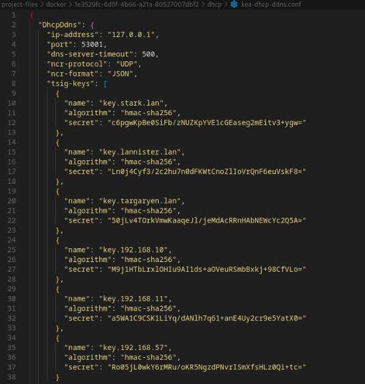

Instala no equipo ned (Debian) un servidor DHCP coa seguinte configuración:

Unha subrede para os equipos da rede privada stark.lan 192.168.10.0/24 con 2 pool.

![ref1]

Un dos pool, asignará enderezos no rango entre .30 e .32 e outro no rango entre .101 e .230. Estes deberán ter como único servidor dns ao equipo arya

![ref1]

Unha subrede para os equipos da rede privada lannister.lan 192.168.11.0/24

Unha subrede para os equipos da rede privada targaryen.lan 192.168.57.0/24 (Conectado ao interface cloud sobre vboxnet1)

Fai que os log, se amosen no ficheiro /var/log/dhcp.log

Deberás crear unha reserva estática que estará no rango de enderezos do seu pool correspondente (para o equipo bran)

Debe actualizar mediante chaves a zona primaria (directa e inversa) no servidor DNS arya.

**CONFIGURACION DE KEA.**

**CONFIGURACION DEL DNS**

Establece os nomes de dominio e servidores DNS de cada zona.

Configura nos equipos ned e robb un servizo DHCP failover para a rede stark.lan e para lannister.lan

Necesitarás polo menos catro clientes (bran, jon, sansha) para a rede stark e tres para a rede lannister (jamie).

Inclúe capturas de:

Configuración (grep -v "^#" /etc/dhcp/dhcpd.conf)

log de ned visualizando a asignación de enderezos en cada un dos pool e da reserva estática

Configuración de servidores DNS, router e enderezo IP de cada cliente

log de ned e robb (simultáneos) facendo unha actualización mediante chaves en arya.

log de ned visualizando asignacións da segunda subrede (lannister) e actualizacións no servidor dns correspondente.

Log dos dous servidores failover cando dous clientes obteñen enderezos

- Os dous funcionan correctamente e os clientes renovan a concesión
- O primeiro co cable desconectado e o segundo contectado, e os clientes renovan a concesión.
- O primeiro co cable conectado e o segundo desconectado, e os clientes renovan a concesión.

Clientes tres dúas subredes, amosando DNS, router e enderezo IP.

A ter en conta no GNS3

- Para obter o enderezo MAC dos VPCs tecleamos **show**
- Para obter o enderezo IP dos VPC tecleamos **ip dhcp**
- Para comprobar os erros do servidor DHCP tecleamos **dhcpd -t**
- Para arrancar o servidor DHCP tecleamos **dhcpd** ou **dhcpd -f**. Se aparece un erro porque non atopa o ficheiro de leases, creamolo co comando **touch**
- Para que funcionen os logs hai que iniciar o proceso **rsyslogd**
- Para parar o servidor dhcp, matamos o proceso con **kill -p <pid>** ou **killall dhcpd**. Podemos ver os PID dos procesos con **ps aux**
- Para activar o servidor relay podemos teclear o comando **dhcrelay -i eth0 <ip\_dhcp1> <ip\_dhcp2>**

[ref1]: Aspose.Words.378a1f77-0b90-4ef9-868c-73ee505efb99.001.png
